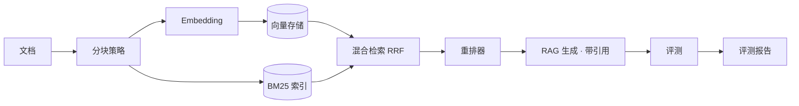

# RAGLab · 评测驱动的 RAG + Agent 应用实验室

> Eval-first RAG & Agent lab：混合检索、带引用的生成、LLM 评测，全部代码可读、可测试、可离线运行。

[](https://github.com/gaoBUAA/raglab/actions/workflows/ci.yml)

RAGLab 是一个面向 **大模型应用工程师面试** 的完整项目：它把企业级 LLM 平台（如 Bisheng）中最核心的 RAG 流水线、Agent 编排和评测体系，用干净、自包含的代码重新实现。**不依赖任何检索库**——BM25 是手写的，向量检索基于 NumPy，评测指标可离线计算，你可以把每一行代码的原理都讲清楚。

## 为什么这个项目有竞争力

- **不套壳**：BM25 倒排索引、RRF 融合、引用抽取、评测指标全部自实现，面试可逐行讲原理。
- **有数据**：内置评测模块，输出带数字的报告（命中率、MRR、忠实度、相关性）。
- **生产思维**：FastAPI 服务、CLI、Docker、GitHub Actions CI、单元测试。
- **随处可跑**：支持 mock 模式离线演示；真实模式兼容 DeepSeek / Qwen / Ollama 等任意 OpenAI 兼容端点。

## 架构



## 快速开始

### 0. 安装

```bash
uv sync --extra dev   # 或 pip install -e ".[dev]"
```

### 1. 离线演示（mock 模式，无需任何 API Key）

```bash
uv run raglab ingest examples/data/buaa.md
uv run raglab query "北航的校训是什么？"
uv run raglab eval-dataset examples/eval_dataset.json
```

### 2. 接入真实模型（DeepSeek / Qwen / Ollama）

复制 `.env.example` 为 `.env` 并填写：

```bash
RAGLAB_LLM_PROVIDER=openai_compat
RAGLAB_LLM_BASE_URL=https://api.deepseek.com/v1
RAGLAB_LLM_API_KEY=sk-xxx
RAGLAB_LLM_MODEL=deepseek-chat
RAGLAB_EMBEDDING_PROVIDER=openai_compat
RAGLAB_EMBEDDING_MODEL=text-embedding-3-small
```

本地模型（Ollama）：

```bash
RAGLAB_LLM_BASE_URL=http://localhost:11434/v1
RAGLAB_LLM_MODEL=qwen2.5:7b
RAGLAB_EMBEDDING_BASE_URL=http://localhost:11434/v1
RAGLAB_EMBEDDING_MODEL=nomic-embed-text
RAGLAB_EMBEDDING_DIM=768
```

### 3. 启动 API 服务

```bash
uv run raglab serve
# http://127.0.0.1:8000/docs 查看 OpenAPI 文档
curl -X POST http://127.0.0.1:8000/ingest \
  -H "Content-Type: application/json" \
  -d '{"document_id":"doc1","source":"公司介绍.md","text":"..."}'
curl -X POST http://127.0.0.1:8000/query \
  -H "Content-Type: application/json" \
  -d '{"question":"北航成立于哪一年？"}'
```

## 评测报告示例

运行 `raglab eval-dataset` 后生成报告（`docs/example_eval_report.md`）：

| 指标 | 均值 | 说明 |
| --- | --- | --- |
| hit_rate@k | 1.0000 | 检索是否命中金标资料 |
| mrr@k | 1.0000 | 金标资料排名位置 |
| precision@k | 0.4000 | 检索结果中金标占比 |
| citation_accuracy | 1.0000 | 引用是否指向金标资料 |
| faithfulness | 1.0000 | 回答是否忠于上下文（LLM 裁判） |
| answer_relevance | 5.0000 | 回答是否切题（LLM 裁判） |

## 项目结构

```text
src/raglab/
├── chunking/      # 分块策略（固定长度 / 递归字符 / Markdown 标题）
├── storage/       # 手写 BM25、NumPy 向量检索、SQLite 元数据
├── retrieval/     # 混合检索（RRF 融合）与重排器
├── pipeline/      # RAG 主流程：检索 → 重排 → 带引用生成
├── agent/         # ReAct Agent、工具调用、对话记忆
├── eval/          # 评测指标、运行器、Markdown 报告
├── api/           # FastAPI 服务
└── cli.py         # 命令行入口
```

## 路线图

- [x] v0.1：混合检索 + RAG + Agent + 评测 + API/CLI
- [ ] 本地 embedding（sentence-transformers）与重排器开箱即用
- [ ] 流式输出与 Web Demo
- [ ] 多文档增量更新与向量索引持久化
- [ ] 更完整的评测数据集与基线对比

## License

MIT
