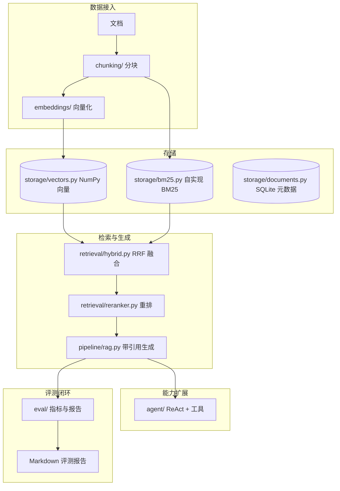

# 架构设计

RAGLab 参考企业级 LLM 平台（如 Bisheng）的模块划分，但刻意保持**小而深**：每个模块都独立、可测试、可替换，核心算法自实现，方便在面试中讲透。

## 模块总览



## 关键设计决策

### 1. 为什么自实现 BM25

不引入 `rank_bm25` 等依赖，用一个文件（约 80 行）实现倒排索引 + BM25 打分：

```text
score(d, q) = Σ IDF(t) * tf(t,d) * (k1+1) / (tf(t,d) + k1*(1-b+b*|d|/avgdl))
IDF(t) = ln((N - df(t) + 0.5) / (df(t) + 0.5) + 1)
```

面试中可以现场推导：`k1` 控制词频饱和、`b` 控制文档长度惩罚。中文分词用字符 bigram，兼顾效果与零依赖。

### 2. 为什么混合检索用 RRF 而不是加权平均

BM25 分数与向量余弦相似度**量纲不同**，直接加权没有意义。RRF 只依赖排名：

```text
score(d) = Σ_retriever 1 / (k + rank(d))
```

鲁棒、无需调权重，这也是企业系统的常见做法。

### 3. 引用（Citation）如何保证可追溯

生成时把检索结果编号为 `[1] [2] ...` 注入上下文，回答后用正则提取 `[n]` 并映射回 chunk id，实现"答案-证据"闭环。评测中的 `citation_accuracy` 就是检查引用是否指向金标资料。

### 4. 评测指标分两层

| 类型 | 指标 | 是否需 LLM |
| --- | --- | --- |
| 检索质量 | hit_rate@k、MRR@k、precision@k | 否（离线可算） |
| 检索语义 | context_relevance | 否（余弦相似度） |
| 答案质量 | faithfulness、answer_relevance | 是（LLM-as-judge） |

先离线指标、后 LLM 裁判的设计，让评测在 CI 里用 mock 也能跑通，接入真实模型后数字才反映真实水平。

### 5. 与 Bisheng 的对应关系

| RAGLab | Bisheng 对应模块 |
| --- | --- |
| `chunking/` | 知识库文档解析/切分 |
| `storage/` | 向量库 + 元数据库 |
| `retrieval/` | 检索服务（混合检索） |
| `pipeline/rag.py` | 应用编排/知识库问答 |
| `agent/` | Agent 应用 |
| `eval/` | 评测中心 |
| `api/` | 后端服务 |

## 数据流

```text
用户问题
  → HybridRetriever（BM25 + 向量 → RRF 融合）
  → 可选 CrossEncoder 重排
  → 编号上下文 + 系统提示词
  → LLM 生成（带 [n] 引用）
  → 引用后处理 → Answer
  → EvalRunner 聚合指标 → 报告
```

## 可扩展点

- 向量存储替换：`VectorStore` 是接口，可换成 FAISS / Milvus / pgvector。
- 检索策略替换：`HybridRetriever` 可加查询改写、HyDE、父文档召回。
- LLM 替换：`BaseLLM` 抽象，任意 OpenAI 兼容端点即插即用。
- 评测扩展：可加入 RAGAS 式完整指标集、A/B 对比、回归门禁。
